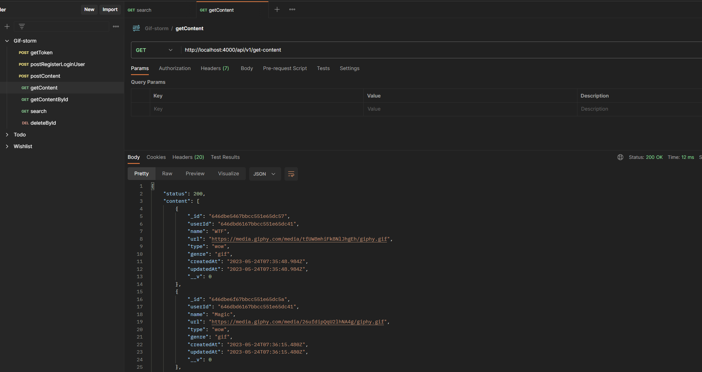

# BACKEND Project: GIFS STORM 
**GIFs and Memes Website**

Welcome to the Backend project README for our GIFs and Memes website! In this document, you will find all the necessary information to understand the backend of the project, set up the development environment, and run the application successfully.

This is a MERN Web-first progect.

## Project Description
Our GIFs and Memes website backend is built using Node.js and MongoDB. It provides the API endpoints and database management for the application. The backend handles requests from the frontend, performs data operations, and sends the appropriate responses.

Login and registration are made with auth0.

## Key features of the application:

- Content Management: The backend allows CRUD operations for GIFs and Memes, including creating, reading and deleting content.
- User Management: It manages user registration, login, and authentication.
- Database Integration: The backend connects to a MongoDB database to store and retrieve content and user information.

## System Requirements
To run the application in your local environment, make sure you have the following installed:

**Node.js** (version 12 or higher)
**NPM** (Node Package Manager) or Yarn

## Environment Setup
Follow the steps below to set up the development environment:

1. Clone the project repository from GitHub: git clone **https://github.com/IuliiaNova/gif-storm-node.git**
2. Navigate to the project's root directory: cd backend
3. Install the project dependencies using NPM or Yarn: ``npm install or yarn install``

## Configuration
Before running the application, you need to configure the environment variables. Create a .env file in the root directory of the backend project and provide the following variables:

```
API_VERSION={}
IP_SERVER={}
PORT_MONGO_DB={}
DB_NAME={}
PORT_SERVER={}

AUTH0_AUDIENCE={}
AUTH0_ISSUER={}

```

## Project Structure

.
├── controllers      // Contains the route handlers and business logic
├── middleware       // Contains middleware functions
├── models           // Contains the data models and schemas
├── routes           // Contains the API route definitions
└── server.js        // Main entry point of the backend server

### Libraries 
+ "auth0" 
+ "cors"
+ "helmet"
+ "nodemon"

## API Endpoints 

| METHOD | ROUTE                  | DESCRIPTION               |
| ------ | ---------------------- | ------------------------- |
| POST   | /create-content        | Create content            |
| GET    | /get-content           | Get all content           |
| GET    | /memes/:id             | Get a meme by ID          |
| GET    | /gifs/:id              | Get a gif by ID           |
| GET    | /search-content/:query | Search content by query   |
| DELETE | /memes/:id             | Delete a content by ID    |
| POST   | /register-login-user   | Register or login a user  |
| GET    | /all-users             | Get all users             |


## Postman 



### Contact
If you have any questions or inquiries related to the project, feel free to contact us via the following email address: **yshihanova@gmail.com**

## Author ✨
<table>
  <td align="center">
    <a href="https://github.com/IuliiaNova">
      
      <br />
      <sub>
      <b>Iuliia Shikhanova</b>
      </sub>
    </a>
    <br />
    <a href="#code-luliianova" title="code-tools-maintenance-design">💻🔧🚧🎨</a>
  </td>
  </tr>
  </table>
